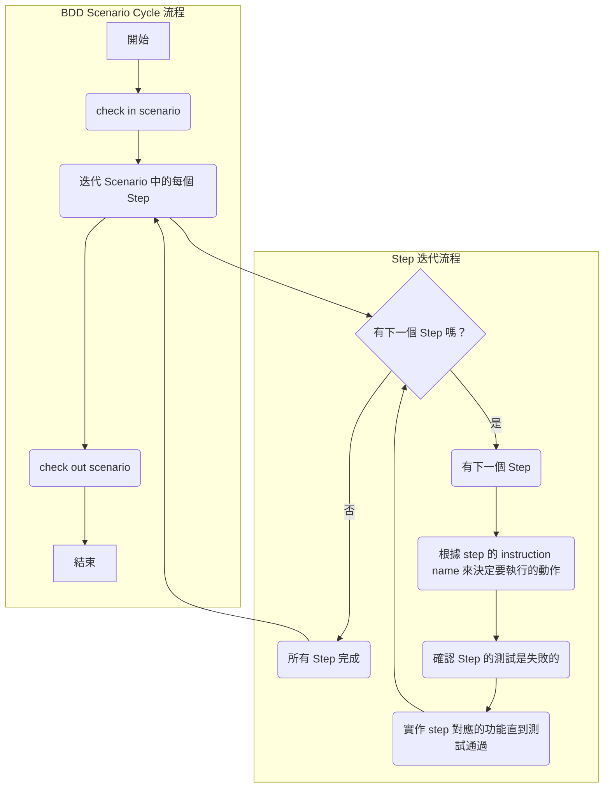
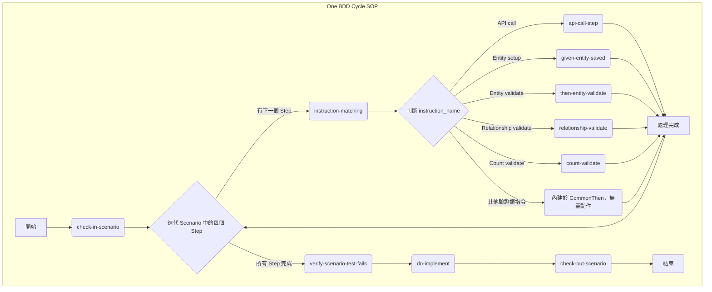

## SOP 流程說明

Input: 你會收到一個指定的 BDD feature「 Scenario 」

```mermaid
graph TD
  subgraph "BDD Scenario Cycle 流程"
    Start[開始]
    CheckIn(check in scenario);
    Iterate(迭代 Scenario 中的每個 Step);
    CheckOut(check out scenario);
    End[結束];


    Start --> CheckIn;
    CheckIn --> Iterate;
    Iterate ---> CheckOut;
    CheckOut --> End;
  end

  subgraph "Step 迭代流程"
    hasNextStep{有下一個 Step 嗎？};
    entrypoint(有下一個 Step);
    exitpoint(所有 Step 完成);
    instruction-matching(根據 step 的 instruction name 來決定要執行的動作);
    verify-step-test-fails(確認 Step 的測試是失敗的);
    do-implement(實作 step 對應的功能直到測試通過);

    Iterate --> hasNextStep;
    hasNextStep -- 是 --> entrypoint;
    hasNextStep -- 否 ----> exitpoint;

    entrypoint --> instruction-matching;
    instruction-matching --> verify-step-test-fails;
    verify-step-test-fails --> do-implement;
    do-implement --> hasNextStep;
    exitpoint --> Iterate;


  end
```

```mermaid
graph TD
    subgraph "One BDD Cycle SOP"
        A[開始] --> B(check-in-scenario);
        B --> C{迭代 Scenario 中的每個 Step};
        C -- 有下一個 Step --> D(instruction-matching);
        D --> E{判斷 instruction_name};
        E -- "API call" --> F(api-call-step);
        E -- "Entity setup" --> G(given-entity-saved);
        E -- "Entity validate" --> H(then-entity-validate);
        E -- "Relationship validate" --> I(relationship-validate);
        E -- "Count validate" --> J(count-validate);
        E -- "其他驗證類指令" --> K(內建於 CommonThen，無需動作);

        F --> L[處理完成];
        G --> L;
        H --> L;
        I --> L;
        J --> L;
        K --> L;

        L --> C;
        C -- 所有 Step 完成 --> M(verify-scenario-test-fails);
        M --> N(do-implement);
        N --> O(check-out-scenario);
        O --> Z[結束];
    end
```
